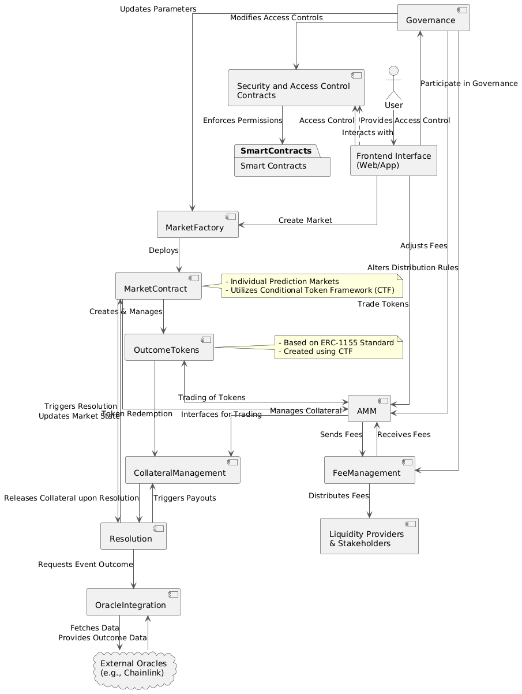

# Morning Star Smart Contract Architecture

Morning Star is a decentralized prediction market platform built on blockchain technology, specifically leveraging Ethereum's smart contract capabilities. This document provides an overview of the smart contract components of the Morning Star project and how they interact, including the role of the Conditional Token Framework (CTF).

## Table of Contents

- [Introduction](#introduction)
- [Key Components](#key-components)
  - [1. Market Factory Contract](#1-market-factory-contract)
  - [2. Market Contracts](#2-market-contracts)
  - [3. Outcome Tokens (Conditional Tokens)](#3-outcome-tokens-conditional-tokens)
  - [4. Automated Market Maker (AMM) Contract](#4-automated-market-maker-amm-contract)
  - [5. Collateral Management Contract](#5-collateral-management-contract)
  - [6. Resolution Contract](#6-resolution-contract)
  - [7. Oracle Integration Contract](#7-oracle-integration-contract)
  - [8. Governance Contract](#8-governance-contract)
  - [9. Fee Management Contract](#9-fee-management-contract)
  - [10. Security and Access Control Contracts](#10-security-and-access-control-contracts)
- [Conditional Token Framework (CTF)](#conditional-token-framework-ctf)
- [Component Interactions](#component-interactions)
- [Conclusion](#conclusion)
- [Additional Resources](#additional-resources)

---

## Introduction

Morning Star enables users to bet on the outcomes of real-world events in a trustless, transparent, and decentralized manner. The platform's smart contract architecture is designed to facilitate efficient and secure prediction markets. This document summarizes the key components of Morning Star's smart contracts and illustrates how they connect and interact, with a focus on the integration of the Conditional Token Framework (CTF).

---

## Key Components

### 1. Market Factory Contract

**Purpose**: Acts as the entry point for creating new prediction markets.

**Functions**:

- **Market Creation**: Allows users to create markets by specifying parameters like the question, possible outcomes, expiration date, and resolution source.
- **Initialization**: Deploys new Market Contracts, ensuring each market operates independently.
- **Registry**: Maintains a list of all active markets for tracking and reference.

### 2. Market Contracts

**Purpose**: Individual contracts for each prediction market, managing the lifecycle of that specific market.

**Functions**:

- **Condition Creation**: Defines unique conditions for each market using the CTF.
- **Outcome Space Definition**: Specifies possible outcomes.
- **State Management**: Keeps track of the market's state (active, resolved, disputed, etc.).

### 3. Outcome Tokens (Conditional Tokens)

**Purpose**: Represent the possible outcomes of a market, created using the CTF and based on the ERC-1155 standard.

**Functions**:

- **Issuance**: Minted when users buy shares in a particular outcome.
- **Redemption**: Can be redeemed for collateral if the outcome they represent is the winning one.
- **Transferability**: Can be transferred between users, allowing for secondary market trading.

### 4. Automated Market Maker (AMM) Contract

**Purpose**: Facilitates the trading of outcome tokens and provides liquidity without requiring a traditional order book.

**Functions**:

- **Pricing Algorithm**: Uses bonding curves to determine prices based on the ratio of outcome tokens in the pool.
- **Liquidity Provision**: Allows users to add liquidity to the pool and earn fees.
- **Trade Execution**: Automatically executes trades based on predefined rules.

### 5. Collateral Management Contract

**Purpose**: Manages the collateral (e.g., stablecoins like USDC) that backs the outcome tokens.

**Functions**:

- **Deposit and Withdrawal**: Handles the movement of collateral into and out of the market.
- **Security**: Ensures that collateral is securely locked until the market is resolved.

### 6. Resolution Contract

**Purpose**: Manages the process of resolving markets and handling disputes.

**Functions**:

- **Market Resolution**: Updates the market state based on the oracle data.
- **Dispute Mechanism**: Allows users to challenge the outcome within a predefined window.
- **Finalization**: Once disputes are settled, the market is finalized, and payouts occur.

### 7. Oracle Integration Contract

**Purpose**: Interfaces with oracle services to fetch real-world data needed to resolve markets.

**Functions**:

- **Data Retrieval**: Calls external oracles (e.g., Chainlink) to get the outcome of the event.
- **Verification**: Ensures the data received is authentic and untampered.
- **Resolution Trigger**: Sends verified outcomes to the Resolution Contract.

### 8. Governance Contract

**Purpose**: Oversees the governance of the platform, enabling community participation in decision-making processes.

**Functions**:

- **Proposal Submission**: Allows users to propose changes to the platform.
- **Voting Mechanism**: Enables token holders to vote on proposals.
- **Implementation**: Executes approved proposals, updating contract parameters as needed.

### 9. Fee Management Contract

**Purpose**: Handles the collection and distribution of fees generated from market activities.

**Functions**:

- **Fee Collection**: Automatically collects fees from trades and liquidity provision.
- **Distribution**: Allocates fees to liquidity providers, the platform, and other stakeholders.
- **Transparency**: Keeps a transparent record of all fees collected and distributed.

### 10. Security and Access Control Contracts

**Purpose**: Ensures the platform's integrity by managing permissions and protecting against malicious activities.

**Functions**:

- **Role Management**: Defines roles like admin, oracle, and users, each with specific permissions.
- **Emergency Functions**: Provides mechanisms to pause or halt operations in case of security threats.
- **Audit Trails**: Keeps records of all critical actions for accountability.

---

## Conditional Token Framework (CTF)

The Conditional Token Framework is integral to Morning Star's operation, serving as the backbone for its prediction markets. Developed by Gnosis, the CTF enables the creation, management, and trading of outcome tokens that represent possible market outcomes.

**Roles in Morning Star**:

- **Foundation of Outcome Tokens**: Provides the structure for creating tokens representing market outcomes using ERC-1155 standard.
- **Facilitates Complex Trades**: Enables splitting and merging of tokens for advanced trading strategies.
- **Underpins the AMM**: Supports efficient and dynamic trading through standardized tokens.
- **Automates Settlement**: Streamlines the resolution process for markets, ensuring fair payouts.
- **Enhances Flexibility**: Allows for innovative market types and financial instruments.
- **Promotes Interoperability**: Ensures compatibility with the broader DeFi ecosystem.
- **Ensures Security**: Leverages a well-tested and audited framework for smart contract safety.

---

## Component Interactions

The components connect and interact as follows:

1. **Market Creation**:

   - Users interact with the **Market Factory Contract** to create new markets.
   - The contract deploys new **Market Contracts**, defining conditions using the **CTF**.

2. **Outcome Tokens**:

   - **Market Contracts** create and manage **Outcome Tokens** representing possible outcomes.
   - Tokens are based on the ERC-1155 standard, allowing efficient handling.

3. **Trading and Liquidity Provision**:

   - Users trade **Outcome Tokens** through the **AMM Contract**.
   - Liquidity providers deposit collateral, receiving rewards.

4. **Market Resolution**:

   - The **Oracle Integration Contract** fetches event outcomes from external oracles.
   - The **Resolution Contract** updates market states and triggers payouts.

5. **Payout and Redemption**:

   - Winning **Outcome Tokens** can be redeemed for collateral via the **Collateral Management Contract**.
   - The **AMM Contract** adjusts to the resolved market.

6. **Governance and Fees**:

   - The **Governance Contract** allows users to propose and vote on platform changes.
   - The **Fee Management Contract** handles the distribution of collected fees.

7. **Security Measures**:
   - **Security and Access Control Contracts** enforce permissions and provide emergency mechanisms.

---

## Conclusion

Morning Star's smart contract architecture is designed to facilitate decentralized prediction markets efficiently and securely. The integration of the Conditional Token Framework is critical, providing a standardized and flexible system for representing conditional assets. Each component works in harmony to provide users with a seamless experience, from market creation to resolution.

---

## Additional Resources

- [Morning Star Documentation](#)
- [Gnosis Conditional Token Framework](https://gnosis.io/conditionaltokens/)
- [ERC-1155 Token Standard](https://eips.ethereum.org/EIPS/eip-1155)
- [Chainlink Oracles](https://chain.link/)

---

**Note**: For the most current information, please refer to the official Morning Star resources, as platform features may have evolved since this summary.
